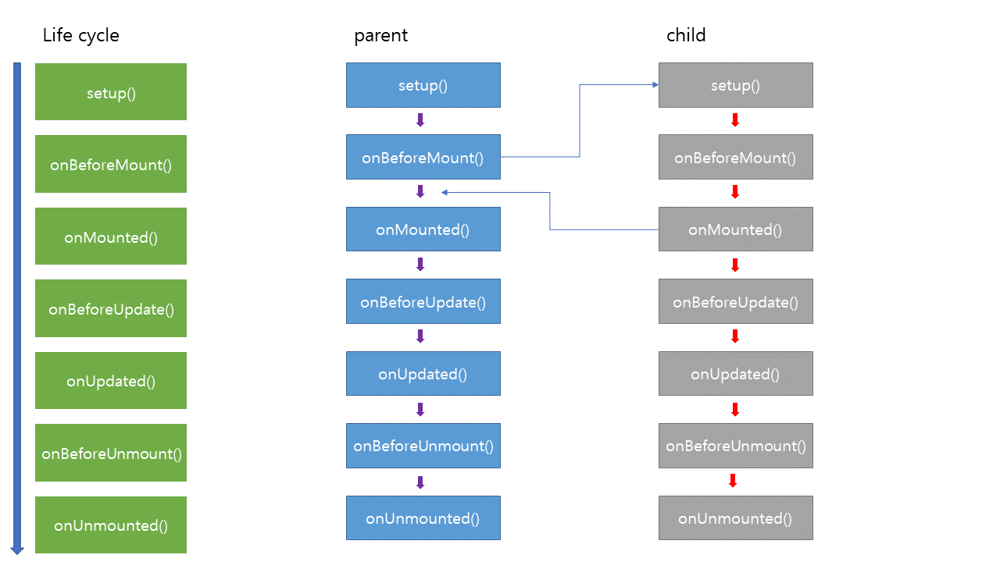

# vue3-study

## project npm script
```
- Project setup
npm install

- Compiles and hot-reloads for development
npm run serve

- Compiles and minifies for production
npm run build

- Lints and fixes files
npm run lint
```

## project setting history
```
npm i -g @vue/cli
vue -V
vue create <project-name>

생성된 vue 프로젝트 폴더로 이동
vue add 명령어를 이용하여 생성된 프로젝트에 플러그인 설치

vue add vue-next
https://github.com/vuejs/vue-cli-plugin-vue-next

플러그인 설치를 하면, package.json 파일 내용을 살펴보면 몇가지 라이브러리에 beta 라고 붙은것들이 존재합니다.
저는 일단 수동으로 alpha 로 변경하였습니다.

```

## 뭐가 달라졌을까?🧐
- src/main.js
```
import { createApp } from 'vue';
import App from './App.vue';

createApp(App).mount('#app');
``` 
> main.js 에서 Vue 생성자 함수를 사용하는게 아닌, createApp 함수를 사용하여 초기화 한다.

- src/components/HelloWorld2.vue
```
<template>
    <!-- 더 이상 root Element 로 감싸지 않아도 된다. -->
    <h1>{{ msg }}</h1>
    <h2>나는 헬로월드 2 이지렁</h2>
</template>
```
> 기존에는 template 에 root element 로 감싸야 했었으나, 이제는 필요가 없다. (Fragment)

- src/components/HelloWorld2.vue
```
<template>
    <!-- 더 이상 root Element 로 감싸지 않아도 된다. -->
    <h1>{{ msg }}</h1>
    <h2>나는 헬로월드 2 이지렁</h2>
    <h3>{{helloMessage}}</h3>
    <hr/>
    <div>
        {{ testMessage }}
        <button @click="changeTestMessage('change!!')"> testMessageChange </button>
    </div>
    <div>
        {{ testMessage2.msg }}
        <button @click="changeTestMessage2('변경이 되었습니다!!')"> testMessageChange2 </button>
    </div>
</template>

<script>

    import { ref } from 'vue'

    const changeTestMessageRef = () => {
        // ref 객체에는 value 속성을 가지고 있음.
        // Takes an inner value and returns a reactive and mutable ref object. => 반응하고 변경가능한 ref 객체를 반환
        // 내부값은 .value 속성을 의미한다.
        const testMessage = ref('이히히히힝!');

        const changeTestMessage = (targetValue) => {
            testMessage.value = targetValue;
        };

        return [testMessage, changeTestMessage];
    };

    const changeTestMessageRef2 = () => {
        // ref 는 원시타입 및 객체에 해당하는 내부값을 가지는 ref 객체 생성 가능
        const testMessage2 = ref({msg : '아햏햏햏햏!'});

        const changeTestMessage2 = (targetValue) => {
            testMessage2.value.msg = targetValue;
        };

        return [testMessage2, changeTestMessage2];
    };

    export default {
        name: 'HelloWorld2',
        props: {
            msg: String
        },

        // The setup function is a new component option
        // Composition API 를 사용하기 위한 진입점 역할(컴포넌트 내에서)
        setup() {

            const [testMessage, changeTestMessage] = changeTestMessageRef();
            const [testMessage2, changeTestMessage2] = changeTestMessageRef2();
            const helloMessage = 'hello composition API';

            setTimeout(() => {
                helloMessage = 'setTimeout change;';
                console.log('setTimeout call..');
            }, 1000); // 1초후에 helloMessage 값을 변경

            // expose to template
            return {
                testMessage, // .value 할 필요가 없다, 자동으로 참조
                changeTestMessage,
                testMessage2,
                changeTestMessage2,
                helloMessage, // 값 변경 시 DOM 에 반영되지는 않는다(not reactive)
            }
        },
    }
</script>
```
> composition API 를 통한 반응형 데이터 정의(ref)

- vue 2 기존
```
<template>
    <div>
        {{msg}}
    </div>
</template>

<script>
    export default {
        data() {
            return {
                msg : 'vue2',
            }
        }  
    }
</script>

```

- computed : 변경 불가능한 ref 객체를 반환받는다.
```
import { ref, computed } from 'vue';
const computedExample = () => {
      const testNumber = ref(1);
      const testNumber2 = ref(2);

      // read-only
      const printNumber = computed(() => testNumber.value);

      console.log(printNumber.value);
      printNumber.value++; //error : Write operation failed: computed value is readonly

      // get, set 함수를 구현하여 사용이 가능
      // writable
      const printNumber2 = computed({
          get : () => testNumber2.value,
          set : value => testNumber2.value = value
      });
      printNumber2.value = 100; // set 함수를 구현하면 쓰기 가능
      console.log(printNumber2.value);

};
```

- src/components/HelloWorld3.vue
```
<template>
    <div>
        <h1>
            {{reactiveStates.text}}
        </h1>
        <p style="font-size: 17px">
            count : {{reactiveStates.count}}
        </p>
        <div>
            <button style="margin: 4px; padding: 2px" @click="reactiveStates.count++">
                add count(reactive)
            </button>
            <button style="margin: 4px; padding: 2px" @click="countIncrease">
                add count(ref)
            </button>
        </div>
        <template v-for="(value, index) in reactiveStateArray">
            <p style="padding: 2px; margin: 0" :key="index">
                {{value}}
            </p>
        </template>
        <hr/>
        <template v-for="(value, index) in reactiveStateArray2">
            <p style="padding: 2px; margin: 0" :key="index + 100">
                {{value}}
            </p>
        </template>
        <div>
            -- readonly
            <p>
                original.count : {{original.count}}
            </p>
            <button @click="original.count++">add original count</button>
            <p>
                originalReadonly.count : {{originalReadonly.count}}<br>
                f12 를 눌러, 크롬 개발자 도구를 확인해보세요!
            </p>
        </div>
    </div>
</template>

<script>

    import {reactive, ref, readonly, watchEffect} from 'vue';

    const countRef = () => {
        const count = ref(0);

        const countIncrease = () => count.value++;

        return [count, countIncrease];
    };

    export default {
        name: "HelloWorld3",

        setup() {

            const [count, countIncrease] = countRef();

            // reactive state
            // 객체를 받고, 반응 프록시 객체를 반환(=== Vue.observable() ) -> ES6 프록시 객체를 생각하면 안됌
            // 이 상태변화 감지는 deep 하게 동작
            const reactiveStates = reactive({
                text: 'hello world3!',
                count, // ref 객체를 reactive object 속성으로 사용이 가능하며, 자동으로 count.value 값을 참조(그래서, reactiveStates.count 로 참조 가능)
            });

            // reactive state -> array
            const reactiveStateArray = reactive([]);
            reactiveStateArray.push(0);
            reactiveStateArray.push(1);
            reactiveStateArray.push(2);

            // 만약 배열요소(컬렉션 요소)에 ref 객체가 있다면 unwrapping 되지 않음(자동으로 .value 참조가 되지 않음)
            const reactiveStateArray2 = reactive([ref('a'), ref('b')]);
            reactiveStateArray2.push('c');
            // console.log(reactiveStateArray2);


            // readonly
            const original = reactive({count: 0});
            // 읽기전용 프록시 원본 객체 반환(중첩된 참조도 전부 읽기전용)
            // 원본 reactive 객체에 값이 변경되면, 읽기전용 프록시 원본객체도 변경이 이루어짐.
            const originalReadonly = readonly(original);

            // 초기 1번 즉시 함수를 즉시실행하고, 종속된 상태값이 변경될 때 마다 다시 실행
            watchEffect(() => {
                // works for reactivity tracking
                console.log(originalReadonly.count);
            });

            // mutating the copy will fail and result in a warning
            originalReadonly.count++; // warning! -> Set operation on key "count" failed: target is readonly

            return {
                reactiveStates,
                countIncrease,
                reactiveStateArray,
                reactiveStateArray2,
                original,
                originalReadonly,
            }
        },
    }
</script>

```
> composition API 를 통한 반응형 데이터 정의(reactive)
> readonly : 읽기전용 프록시 원본 객체 반환(그래서, 원본객체가 변경이 되면 읽기전용 객체도 변경이 이루어짐)
> watchEffect : 1번 즉시 실행 후, 종속된 상태값이 변경될 때 마다 다시 실행(반응성 추적)

- 반응형 상태(reactive data) 정의는 ref, reactive 를 활용
- ref 는 원시타입 및 객체도 받으며, reactive 는 객체만 받음
- isRef(), isReactive() 메서드는 반응형 객체가 ref 타입인지 reactive 타입인지 검사를 한 후 boolean 반환(src/App.vue 참조) 
- watch 와 watchEffect 차이는 초기에 즉시실행이 되냐 안되냐 여부 (src/components/HelloWatch.vue 참조)

- vue 3 life cycle (on 이라는 접두사를 사용하는 형태로 바뀌고, creation 생명주기가 setup() 으로 대체)
> ~~beforeCreate~~ -> use setup()<br>
  ~~created~~ -> use setup() <br>
  beforeMount -> onBeforeMount <br>
  mounted -> onMounted <br>
  beforeUpdate -> onBeforeUpdate <br>
  updated -> onUpdated <br>
  beforeDestroy -> onBeforeUnmount <br>
  destroyed -> onUnmounted <br>
  errorCaptured -> onErrorCaptured <br>
> 


### Customize configuration
See [Configuration Reference](https://cli.vuejs.org/config/).
